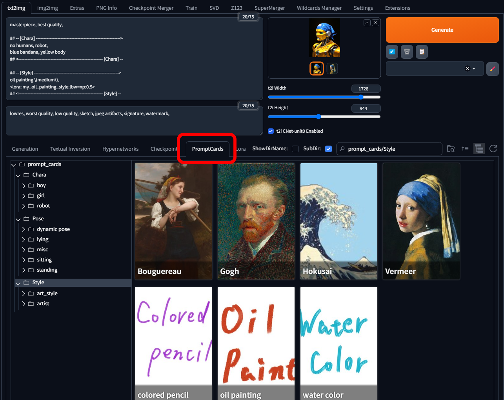

# Prompt Cards Manager
[日本語README](./README_ja.md)

## Overview
This is an extension for [AUTOMATIC1111/stable-diffusion-webui](https://github.com/AUTOMATIC1111/stable-diffusion-webui) that allows you to manage prompts and negative prompts using card-based units, similar to LoRA. You can register any prompt for any image, and display the images as cards in the **PromptCards** tab of Extra Networks.
By clicking on a card, you can input the registered prompt or replace a prompt that has already been entered on another card.

* Example uses:
  - Reuse favorite prompts with a single card click
  - Switch parts of prompts (characters, poses, situations) with a card click
  - Manage prompts for LoRAs that have learned multiple concepts (clothing, characters) as cards for each concept
  - Manage complex prompts combining multiple LoRAs or wildcards, etc, as a single card
etc.

If you use forge WebUI, you can also set the card image directly to ControlNet by clicking a dedicated button.
(Currently only for forge builtin ControlNet)

Note that this extension does not have features to automatically generate prompts or apply them randomly.

-----------------------------------------------------------------------------------------------------------------------------
## Update History
* 2025/03/18
  - Added an option to choose `Ctrl+Q` key for canceling Card Edtior instead of `Esc`.
  - Removed file name extension from card display.
  - Added an option to fix [sd-dynamic-prompts](https://github.com/adieyal/sd-dynamic-prompts) 's template pasting behavior.
    + Enabling the `Fix sd-dynamic-prompts 'Template:' pasting behavior` option in this extension's Settings,
      the issue, where all comment lines that were saved as template in png_info with sd-dynamic-prompts’ `Save template to metadata` option are completely removed when restoring as generation parameters from images, will be fixed.
      (Disabled by default)
  - Bug fix.

* 2027/03/17
  - Added an option to ignore `.` starting files and dirs (such as `.git`)

* 2025/03/15
  - First version

-----------------------------------------------------------------------------------------------------------------------------
## Prerequisites
* This extension inserts prompts surrounded by decorative lines starting with `#`
  Make sure you have another extension installed that treats lines starting with `#` as comments
  - For example, [sd-dynamic-prompts](https://github.com/adieyal/sd-dynamic-prompts) has such functionality
  - Also, if you're using a forge-based WebUI, it probably comes with this functionality by default
  - You can operate without using decorative lines by turning off `Replace Mode` ([described later](#prompt-registration-modal-window)), but in that case, prompt replacement cannot be performed

-----------------------------------------------------------------------------------------------------------------------------
## How to Use
### Card Preparation
#### Image Placement
* Place any images in the `extensions/sd-webui-prompt-cards-manager/prompt_cards` folder
  - It recognizes `.png`, `.jpg`, `.jpeg`, `.webp` files
  - By default, files and dirs starting with `.` (such as `.git`) are ignored.
    If you needs them, you can set the option to not to be ignored in the Settings section.

* Like LoRA, you can create subfolders to classify and manage cards more easily
  - This extension treats the first-level folder name as the "**category**" of that card

* After placing images in the folder, press the refresh button in the top right of the PromptCards tab,
  and the placed images will be displayed as cards

#### Registering Prompts to Cards
* Press the Card Edit button (`i` button) in the top right of the card to display the prompt registration modal screen ([described later](#prompt-registration-modal-window)),
  enter the prompts you want to register in Prompt and Negative Prompt, and press Save

### Using Cards
* Clicking a card will apply the registered Prompt and Negative Prompt
  - Prompts are surrounded by decorative lines that include the category name (= first-level subfolder name)
    + If decorative lines with the same category name already exist, they will be replaced
    + Otherwise, they will be added to the end
  - Clicking the same card consecutively toggles between applying and removing the prompt

* Since this extension just performs text input, you can freely edit prompts including those in decorative lines
  - If you click a card of the same category again, all content within the decorative lines will be deleted and replaced
  - Since the decorative lines are used as markers for detection, if you change the decorative lines, the replacement target cannot be detected and prompt will be added to the bottom of the current prompt

* Cards with `Replace Mode` ([described later](#prompt-registration-modal-window)) turned off will not use decorative lines, and the registered prompts will simply be added to the bottom

#### Using ControlNet
* For cards with `CNet Enabled` checked ([described later](#prompt-registration-modal-window)), a button to set the card image to ControlNet will be displayed
  - With clicking this button, the card image is automatically put in the ControlNet unit.
  - ControlNet settings can be configured in the WebUI's Settings tab (currently cannot be changed per card)
  - After changing `CNet Enabled` check/uncheck, you need to press refresh button in the card list view to redraw the button display
  - Currenly a1111 is not supported. (Only for forge builtin ControlNet)

-----------------------------------------------------------------------------------------------------------------------------
# Screen Descriptions
## Extra Networks Prompt Cards Tab
* You can choose both tree style view and directory style view
  - `Settings` > `Stable Diffusion` > `Extra Networks` > `Extra Networks directory view style`
  - When you change this setting, you need to restart WebUI server

* `SubDir` checkbox toggles whether to display cards from subfolders of the selected folder.

## Prompt Registration Modal Window
* Pressing the Card Edit button in the top right of the card opens a screen like this

* Prompt
  - Enter any prompt you want to register for this card
  - Completion by [a1111-sd-webui-tagcomplete](https://github.com/DominikDoom/a1111-sd-webui-tagcomplete) works
  - If a txt file with the same name as the image exists (e.g. `foo.txt` for `foo.png`),
    the content of that txt file will be automatically loaded into the `Prompt` text area.

* Negative Prompt
  - Same as Prompt

* Description
  - Use this as a memo for card description

* Replace Mode
  - When checked, Prompt and Negative Prompt are inserted with decorative lines
    Also, if text of the same category is already entered, that location will be replaced
  - When turned off, decorative lines are not used and text is simply added to the end of the current Prompt and Negative Prompt

* CNet Enabled
  - Determines whether to display a button to set the card image to Control Net for this card
  - After changing, please reload the card list with the refresh button in the top right of the tab

* Apply Resolution to Generation Parameters
  - When checked, not only the prompt but also the resolution registered here will be set to the generation parameters resolution
  - When turned off, the values registered here are ignored and the resolution is not changed
  - Utility buttons for resolution registration
    + Lock button: Move the slider while maintaining the aspect ratio
    + 1/2 button: Sets to 1/2 of the current resolution
    + 8n button: Adjusts the current resolution values to the nearest multiple of 8
    + 64n button: Similar to 8n, adjusts to multiples of 64

* Set Data from Image Metadata buttons in the right column
  - Prompt: If the card image was AI-generated (precisely, if it contains Stable Diffusion metadata), copies the Prompt from the metadata to the Prompt area on the left
  - Negative Prompt: Same as Prompt
  - Resolution: Copies the resolution values of the card image to the resolution sliders on the left

* You can also use the `Esc` key instead of the Cancel button to cancel this screen

## Settings
* In the WebUI's Settings under `Uncategorized` > `Prompt Cards Manager`, you can configure various default values when loading new images and settings for when setting images to ControlNet
