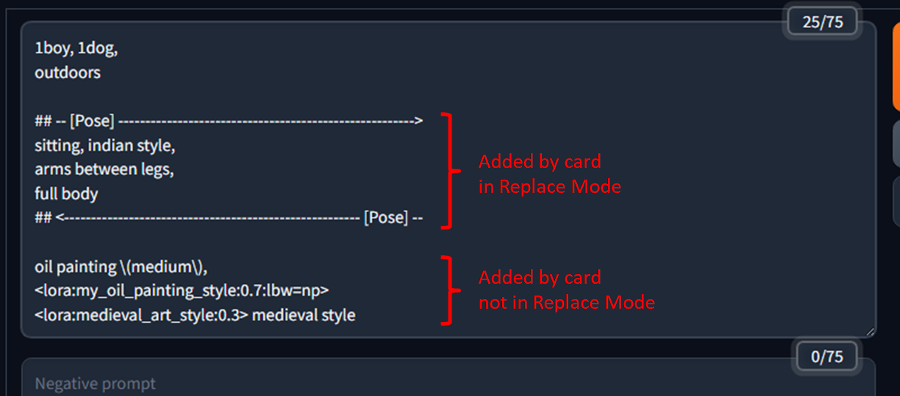
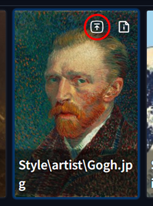
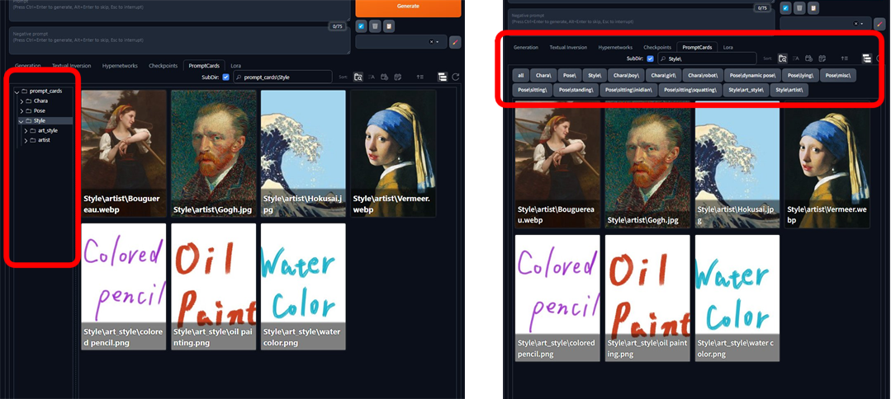
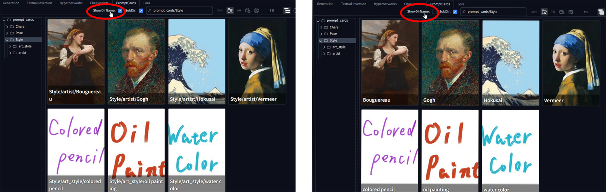

# Prompt Cards Manager

## 概要
プロンプトやネガティブプロンプトを LoRA 等と同様にカードで管理できる [AUTOMATIC1111/stable-diffusion-webui](https://github.com/AUTOMATIC1111/stable-diffusion-webui) 用の拡張機能です。
任意の画像に任意のプロンプトを登録することができ、Extra Networks の **PromptCards** タブにカードとして表示されます。
カードをクリックすることで、登録したプロンプトの入力や、別のカードで既に入力済みのプロンプトの置換が行えます。

また付加的な機能として、プロンプトエリアの右横に常に画像の生成結果を表示するミニギャラリーを追加します。
これにより Generation タブとの間を行き来せずに生成結果を見ながらプロンプトの調整が行えます。(不要な場合は `Setting` で非表示)


* 用途例：
  - お気に入りのプロンプトをカードクリックで手軽に呼び出す
  - プロンプトの一部(人物やポーズ、シチュエーション)をカードクリックで切り替える
  - 複数の概念 (服装や人物) を学習したLoRAのプロンプトを概念ごとにカードとして管理する
  - 複数のLoRAやワイルドカードなどを組み合わせた複雑なプロンプトを纏めてカードとして管理する
etc.

また、forge 系の WebUI の場合、専用のボタンをクリックすることでカードの画像をそのまま ControlNet にセットすることもできます。
(a1111 は未対応)

なお、この拡張はプロンプト自体を自動生成したりランダムで適用するような機能は持っていません。


-----------------------------------------------------------------------------------------------------------------------------
## 更新履歴
* 2025/04/02
  - カード情報編集画面の Resolution ボタンを解像度 1024 にスケールしてセットするよう変更

* 2025/04/02
  - 開いているカードフォルダをエクスプローラで開くボタンをタブ右上に追加 (Windows Only)
  - カード表示オプションをチェックボックスからアイコンに変更
  - カードのカテゴリにエイリアスを設定する機能を追加 ([カテゴリエイリアス](#フォルダ毎にカテゴリ名を明示的に指定))
  - bug fix.

* 2025/03/31
  - カード情報の JSON ファイルが存在しないカードに黄色の枠線を追加
  - bug fix. カード更新処理に伴う UI 表示

* 2025/03/30
  - bug fix. 画像ファイルのパス長が長い場合に画像キャッシュのファイル名をトリミングするよう変更

* 2025/03/27
  - bug fix. カード更新処理に伴う UI リフレッシュによる影響を安定化

* 2025/03/25
  - フォルダツリービューの見た目を向上
  - ミニギャラリーに Seed のコントローラを追加、Settings から項目ごとに表示／非表示選択可能
  - `Ctrl - <0-9>` キーの挙動変更 ([ショートカットキー](#キーボードショートカット))
  - bug fix

* 2025/03/23
  - 見た目の調整
  - カード検索に Prompt 検索と Description 検索の機能を追加
  - bug fix

* 2025/03/22
  - PromptCards タブ上でカテゴリの切り替えにキーボードショートカットを追加 ([ショートカットキー](#キーボードショートカット))
  - ミニギャラリーの機能を拡充

* 2025/03/20
  - ミニギャラリーに解像度スライダーとCNetのチェックボックスを追加
  - カードエディタ画面の保存ボタンのショートカットとして `Ctrl-S` を追加 (オプションで無効化可能)

* 2025/03/19
  - ミニギャラリーを追加
    + プロンプトエリアの右横に常に生成結果を確認できる画面を表示 ([サンプル](#ミニギャラリー))
    + 不要な場合 `Settings` で非表示にできます (デフォルト ON)

* 2025/03/18
  - カードの表示名を調整
    + `ShowDirName` チェックボックスの追加(フォルダ名の表示／非表示をトグル)
    + フォルダの区切り文字の表示を環境に依らず `/` に統一
    + カードの表示名からファイル拡張子を削除
  - カードエディタ画面のキャンセル用キーボードショーカットに `Esc` ではなく `Ctrl+Q` を使用するオプションを追加
  - [sd-dynamic-prompts](https://github.com/adieyal/sd-dynamic-prompts) の template の貼り付けに係る処理の不具合を修正するオプションを追加
    + 本拡張の Settings で `Fix sd-dynamic-prompts 'Template:' pasting behavior.` を有効にすると、
      sd-dynamic-prompts の `Save template to metadata` を有効にして保存した画像のメタデータを用いて
      生成パラメータを復元する際、保存されたはずのコメント行が全て消える挙動が修正されます。
      (デフォルトでは無効)
  - bug fix

* 2025/03/17
  - `.` で始まるファイルやフォルダ (`.git`等) を無視するオプションを追加 (デフォルトで有効)

* 2025/03/15
  - 最初のバージョン


-----------------------------------------------------------------------------------------------------------------------------
## 前提
* 本拡張はプロンプトを `#` で始まる装飾行で囲んで挿入します
  `#`で始まる行をコメントとして扱う拡張機能が別途導入済みであることを確認して下さい
  - 例えば [sd-dynamic-prompts](https://github.com/adieyal/sd-dynamic-prompts) がそのような機能を持っています
  - また、forge系のWebUIであれば、おそらく何も追加で入れなくても最初から入っていると思います
  - `Replace Mode` ([後述](#プロンプト登録用モーダル画面))  をオフにすることで装飾行を使わない動作もできますが、その場合プロンプトの置換は行えません


-----------------------------------------------------------------------------------------------------------------------------
## 使い方
### カードの準備
#### 画像の配置
* `extensinos/sd-webui-prompt-cards-manager/prompt_cards` フォルダに任意の画像を置いて下さい
  - `.png`, `.jpg`, `.jpeg`, `.webp` を認識します
  - デフォルトでは `.` で始まるフォルダやファイル(`.git` など)を除外します
    除外したくない場合は `Settings` セクションのオプションで変更してください

* LoRA等と同じ様に、カードを管理しやすいようサブフォルダを作成して分類できます
  - 本拡張は第一階層のフォルダ名をそのカードの "**カテゴリ**" として扱います
    + カテゴリとしてフォルダ名そのものではなく、フォルダ事にカテゴリ名を別途セットすることも可能です

* 画像をフォルダに置いた後、WebUIのPromptCardsタブ右上のリフレッシュボタンを押すと、
  置いた画像がカードとして表示されます


##### フォルダ毎にカテゴリを明示的に指定
* 例えば `character_001` フォルダと `character_002` フォルダを作った場合、どちらもカテゴリは同じ `character` にするなど

* 設定の仕方
  1. `promt_cards` フォルダにテキストファイルを新規作成し `_category_alias.yaml` という名称にする
  2. そのファイルに割り当てたいカテゴリ名を `"フォルダ名": "カテゴリ名"` のように1行ずつ記載
    - `*` は任意の文字列にマッチ

* 例 : `character_` で始まるフォルダは全て `character`, `pose_` で始まるフォルダは全て `pose` カテゴリにする

```yaml
"character_*": "character"
"pose_*": "pose"
```


#### カードにプロンプトを登録
* カード右上の Card Edit ボタン (`i`ボタン) を押すとプロンプト登録用のモーダル画面 ([後述](#プロンプト登録用モーダル画面)) が表示されますので、
  Prompt, Negative Prompt に登録したいプロンプトを入力して Save を押してください


### カードの使用
* カードをクリックすると登録したプロンプトとネガティブプロンプトが反映されます
  - プロンプトは `## -->` の修飾行で囲まれます
    + 修飾行には **カテゴリ名** (=第一階層のサブフォルダ名) を含みます
    + 同一のカテゴリ名を持つ修飾行が既に存在する場合は、置換されます
    + 存在しない場合は末尾に追加されます
  - 同一のカードを連続でクリックした場合は、反映と削除のトグル動作になります

* この拡張はテキスト入力をワンクリックで行うだけなので、プロンプトは自由に編集して問題ありません
  - 同一カテゴリのカードを再度クリックした場合は、装飾行の内部は全て消して置換されます
  - プロンプトの内容ではなく装飾行を検知の目印として用いているため、装飾行そのものを崩すような変更を加えた場合は置換対象を検知できず、末尾に追加されます

* プロンプト登録画面で`Replace Mode` をオフにしたカードは装飾行は使われず、登録したプロンプトがそのまま末尾に追加されるだけの動作になります([後述](#プロンプト登録用モーダル画面)) 




#### ControlNet の使用
* CNet Enabled にチェック ([後述](#プロンプト登録用モーダル画面)) を入れたカードについては、ControlNet にカード画像をセットするためのボタンが表示されます
  - チェック／アンチェックの変更後はカード一覧のリフレッシュを押さないとボタン表示が反映されません
  - ControlNet の設定値は WebUI の Settings タブで設定できます (現状カード毎には変えられません)
  - a1111 には現状対応していません (forge のビルトインの CNET 機能のみ)



-----------------------------------------------------------------------------------------------------------------------------
# 画面の説明
## Extra Networks の Prompt Cards タブ
* ツリービューとディレクトリビューのどちらにも対応しています
  - `Settings` > `Stable Diffusion` > `Extra Networks` の `Extra Networks directory view style` で切り替わりますが、
    設定で切り替えた場合は一度サーバを再起動しないとエラーが出ます



### キーボードショートカット
  - `Ctrl + 1 ~ 9` : カテゴリの1つ目から9つ目までを切り替えが行えます。連続して押すことでサブフォルダを順に移動します。
  - `Ctrl + 0` / `Alt + 0` : カテゴリ切り替えの Undo / Redo が行えます

### コントロールベルト
  - `Image Fit` ボタン : カードの画像をフィットさせて表示するか否か
  - `Show Description` ボタン : カードに Description を表示するか否か
  - `Show DirName` ボタン : カードにフォルダ名も表示するか否か
  - `Show SubDir` ボタン : 選択中のフォルダのサブフォルダのカードも表示するか否か
  - `Prompt Search` ボタン : カードに登録したプロンプトからマッチするものをフィルタリング
    + 半角スペースと半角カンマの両方をセパレータとしてAND条件を指定可能
  - `Multiple Search` テキストボックス : カードに登録した Description, Prompt, カードファイルのパス の何れかにマッチするものをフィルタリング
    + 半角スペースをセパレータとしてAND条件を指定可能
  - `Open Folder` ボタン : 現在開いているカードフォルダをエクスプローラで開く (Windows Only)
    + サーバをネットワークに公開してリモートから接続する形で利用している場合は Settings から機能を無効にしてください



### ミニギャラリー
  - プロンプトの右横に、`Generation` タブの中にある標準の生成結果表示コンポーネントと同じ内容の小さな画面を常に表示できます
  - 各種設定値は Generation タブと連動しています
  - ミニギャラリーが不要な場合は `Settings` > `Show Mini Gallery` のチェックを外してください


## カード情報編集画面
* カード右上の Card Edit ボタンを押すと下のような画面が開きます


* Prompt
  - このカードに登録したいプロンプトを好きなように入力してください
  - [a1111-sd-webui-tagcomplete](https://github.com/DominikDoom/a1111-sd-webui-tagcomplete) による補完が効きます
  - 画像ファイルと同名の txt ファイルが存在した場合 (例. `foo.png` に対して `foo.txt` が存在)、
    その txt ファイルの中身が自動的に `Prompt` エリアに読み込まれます。

* Negative Prompt
  - Prompt と同様

* Description
  - カードの説明のメモ書きとして使ってください

* Replace Mode
  - チェックすると、Prompt, Negative Prompt が装飾行付きで挿入されます
    また、既に同一カテゴリのテキストが入力されていた場合はその場所が置換されます
  - オフにすると、装飾行は使わず現在のPrompt、Negative Prompt の末尾に追加されます

* CNet Enabled
  - Control Net にカード画像をセットするためのボタンをこのカードに表示するか否かです
  - 変更後はタブ右上のリフレッシュボタンでカード一覧を再読み込みしてください

* Apply Resolution to Generation Parameters
  - チェックすると、プロンプトだけでなく、ここに登録した解像度も生成パラメータの解像度にセットされます
  - オフにすると、ここに登録した数値は無視され、解像度は変更しません
  - 解像度登録用のユーティリティボタン類
    + 鍵マークボタン : アスペクト比を固定してスライダを動かせます
    + 1/2 ボタン : 現在の解像度の 1/2 にします
    + 8n ボタン : 現在の解像度の数値を最も近い 8 の倍数にします
    + 64n ボタン : 8n と同様に 64 の倍数にします

* 右列の Set Data from Image Metadata ボタン類
  - Prompt : カード画像が AI 生成で合った場合 (Stable Diffusionのメタデータが入っていた場合)、メタデータ内の Prompt を左のPromptエリアにコピーします
  - Negative Prompt : Prompt と同様
  - Resolution : カード画像の解像度の値を1024サイズの解像度になるようスケールして左列の解像度スライダにコピーします

* Cancel ボタンの代わりに `Esc` キーでもモーダルをキャンセルできます

## Settings
* WebUI の Settings の `Uncategorized` > `Prompt Cards Manager` で新しい画像を読み込んだ際の各種デフォルト値や、ControlNet に画像をセットする際の値の設定が行えます

# 既知の不具合
* この拡張は大量の画像をブラウザで扱えるようにするために、画像を読み込む際に軽量なサムネイル画像を作成してキャッシュする。
  大量の画像(数百枚とか)を一度に追加・変更して更新ボタンを押すと、その処理に時間がかかるためフレームワーク側のタイムアウトが発生して、
  PromptCardsタブの暗転が戻らない場合がある。(古いGradioのコールバックチェーンの問題)
  タイムアウトしてもサーバ側の内部処理に問題が発生したわけではないので、その場合はブラウザをリロードして再度ページを読み込めば、
  次以降は正常に読み込まれる。


# Credits
This extension uses the folloing third-party resouces.

## Icons
* https://www.svgrepo.com/svg/485431/info-1, LICENSE: CC Attribution License, AUTHOR: Anastasia Savenko
* https://www.svgrepo.com/svg/335585/lock-unlocked, LICENSE: MIT License, AUTHOR: BrightspaceUI
* https://www.svgrepo.com/svg/335586/lock, LICENSE: MIT License, AUTHOR: BrightspaceUI
* https://www.svgrepo.com/svg/524192/upload-square, LICENSE: CC Attribution License, AUTHOR: Solar Icons
* https://www.svgrepo.com/svg/524193/upload-twice-square, LICENSE: CC Attribution License, AUTHOR: Solar Icons
* https://www.svgrepo.com/svg/371822/details, LICENSE: MIT License, AUTHOR: vmware
* https://www.svgrepo.com/svg/376060/file-tree, LICENSE: MIT License, AUTHOR: Gitlab
* https://www.svgrepo.com/svg/435987/window, LICENSE: MIT License, AUTHOR: Flux Icons
* https://www.svgrepo.com/svg/532815/folder-exclamation, LICENSE: CC Attribution License, AUTHOR: Dazzle UI
* https://www.svgrepo.com/svg/525443/minimize-square-minimalistic, LICENSE: CC Attribution License, AUTHOR: Solar Icons
