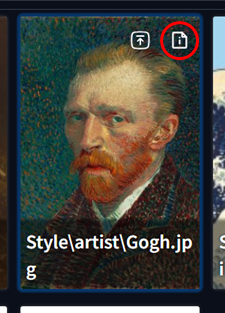
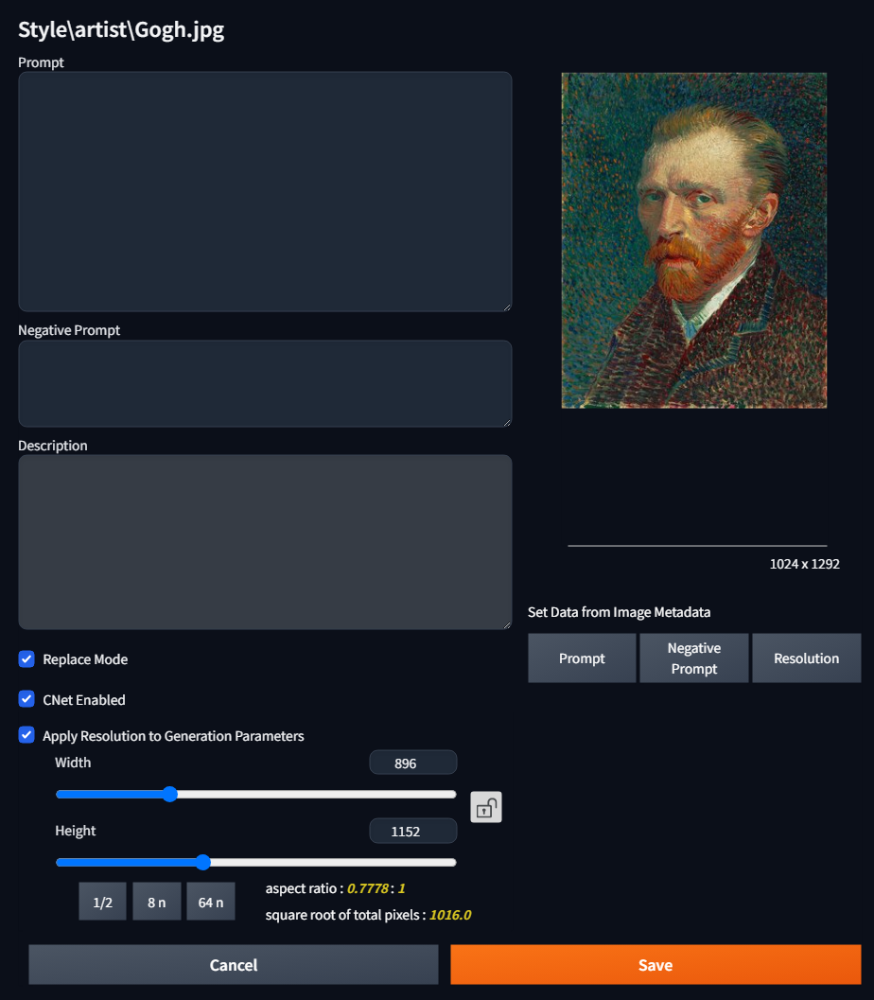

# Prompt Cards Manager

## 概要
プロンプトやネガティブプロンプトを LoRA 等と同様にカード単位で管理できる [AUTOMATIC1111/stable-diffusion-webui](https://github.com/AUTOMATIC1111/stable-diffusion-webui) 用の拡張機能です。
任意の画像に対して任意のプロンプトを登録することができ、Extra Networks の **PromptCards** タブに画像をカードとして表示します。
カードをクリックすることで、登録したプロンプトの入力や、別カードで既に入力済みのプロンプトの置換が行えます。

* 用途例：
  - お気に入りのプロンプトをカードクリックで手軽に呼び出す
  - プロンプトの一部(人物やポーズ、シチュエーション)をカードクリックで切り替える
  - 複数の概念 (服装や人物) を学習したLoRAのプロンプトを概念ごとにカードとして管理する
  - 複数のLoRAやワイルドカードなどを組み合わせた複雑なプロンプトを纏めてカードとして管理する
etc.

また、forge 系の WebUI の場合、専用のボタンをクリックすることでカードの画像をそのまま ControlNet にセットすることもできます。
(a1111 は未対応)

なお、この拡張はプロンプト自体を自動生成したりランダムで適用するような機能は持っていません。

-----------------------------------------------------------------------------------------------------------------------------
## 更新履歴
* 2025/03/18
  - カードの表示名を調整
    + `ShowDirName` チェックボックスの追加(フォルダ名の表示／非表示をトグル)
    + フォルダの区切り文字の表示を環境に依らず `/` に統一
    + カードの表示名からファイル拡張子を削除
  - カードエディタキャンセル用キーボードショーカットに `Esc` ではなく `Ctrl+Q` を使用するオプションを追加
  - [sd-dynamic-prompts](https://github.com/adieyal/sd-dynamic-prompts) の template の貼り付けに係る処理の不具合を修正するオプションを追加
    + 本拡張の Settings で `Fix sd-dynamic-prompts 'Template:' pasting behavior.` を有効にすると、
      sd-dynamic-prompts の `Save template to metadata` を有効にして保存した画像のメタデータを用いて
      生成パラメータを復元する際、保存されたはずのコメント行が全て消える挙動が修正されます。
      (デフォルトでは無効)
  - バグの修正

* 2025/03/17
  - `.` で始まるファイルやフォルダ (`.git`等) を無視するオプションを追加 (デフォルトで有効)

* 2025/03/15
  - 最初のバージョン

-----------------------------------------------------------------------------------------------------------------------------
## 前提
* 本拡張はプロンプトを `#` で始まる装飾行で囲んで挿入します
  `#`で始まる行をコメントとして扱う拡張機能が別途導入済みであることを確認して下さい
  - 例えば [sd-dynamic-prompts](https://github.com/adieyal/sd-dynamic-prompts) がそのような機能を持っています
  - また、forge系のWebUIであれば、おそらく何も追加で入れなくても最初から入っていると思います
  - `Replace Mode` ([後述](#プロンプト登録用モーダル画面))  をオフにすることで装飾行を使わない動作もできますが、その場合プロンプトの置換は行えません

-----------------------------------------------------------------------------------------------------------------------------
## 使い方
### カードの準備
#### 画像の配置
* `extensinos/sd-webui-prompt-cards-manager/prompt_cards` フォルダに任意の画像を置いて下さい
  - `.png`, `.jpg`, `.jpeg`, `.webp` を認識します
  - デフォルトでは `.` で始まるフォルダやファイル(`.git` など)を除外します
    除外したくない場合は `Settings` セクションのオプションで変更してください

* LoRA等と同じ様に、カードを管理しやすいようサブフォルダを作成して分類できます
  - 本拡張は第一階層のフォルダ名をそのカードの "**カテゴリ**" として扱います

* 画像をフォルダに置いた後、WebUIのPromptCardsタブ右上のリフレッシュボタンを押すと、
  置いた画像がカードとして表示されます

#### カードにプロンプトを登録
* カード右上の Card Edit ボタン (`i`ボタン) を押すとプロンプト登録用のモーダル画面 ([後述](#プロンプト登録用モーダル画面)) が表示されますので、
  Prompt, Negative Prompt に登録したいプロンプトを入力して Save を押してください

### カードの使用
* カードをクリックすると登録した Prompt と Negative Prompt が反映されます
  - プロンプトはカテゴリ名 (=第一階層のサブフォルダ名) を含んだ修飾行で囲まれます
    + 同一のカテゴリ名を持つ修飾行が既に存在する場合は、置換されます
    + そうでなければ末尾に追加されます
  - 同一のカードを連続でクリックした場合は、プロンプト反映・削除のトグル動作になります

* この拡張はテキスト入力をワンクリックで行うだけなので、装飾行の中も含めてプロンプトは自由に編集して問題ありません
  - 同一カテゴリのカードを再度クリックした場合は、装飾行の内部は全て消えて置換されます
  - プロンプトの内容ではなく装飾行を検知の目印として用いているため、装飾行自体を変更した場合は置換対象を検知できず、末尾に追加されます

* プロンプト登録画面で`Replace Mode` をオフにしたカードは装飾行は使われず、登録したプロンプトがそのまま末尾に追加されるだけの動作になります([後述](#プロンプト登録用モーダル画面)) 

#### ControlNet の使用
* CNet Enabled にチェック ([後述](#プロンプト登録用モーダル画面)) を入れたカードについては、ControlNet にカード画像をセットするためのボタンが表示されます
  - チェック／アンチェックの変更後はカード一覧のリフレッシュを押さないとボタン表示が反映されません
  - ControlNet の設定値は WebUI の Settings タブで設定できます (現状カード毎には変えられません)
  - a1111 には現状対応していません (forge のビルトインの CNET 機能のみ)

-----------------------------------------------------------------------------------------------------------------------------
# 画面の説明
## Extra Networks の Prompt Cards タブ
* ツリービューとディレクトリビューのどちらにも対応しています
  - `Settings` > `Stable Diffusion` > `Extra Networks` の `Extra Networks directory view style` で切り替わりますが、
    設定で切り替えた場合は一度サーバを再起動しないとエラーが出ます

* `SubDir` チェックボックスは選択中のフォルダのサブフォルダのカードも表示するかどうかトグルで切り替える機能です
* `ShowDirName` checkbox toggles whether to display each card's folder path or not.

## プロンプト登録用モーダル画面
* カード右上の Card Edit ボタンを押すと下のような画面が開きます

* Prompt
  - このカードに登録したいプロンプトを好きなように入力してください
  - [a1111-sd-webui-tagcomplete](https://github.com/DominikDoom/a1111-sd-webui-tagcomplete) による補完が効きます
  - 画像ファイルと同名の txt ファイルが存在した場合 (例. `foo.png` に対して `foo.txt` が存在)、
    その txt ファイルの中身が自動的に `Prompt` エリアに読み込まれます。

* Negative Prompt
  - Prompt と同様

* Description
  - カードの説明のメモ書きとして使ってください

* Replace Mode
  - チェックすると、Prompt, Negative Prompt が装飾行付きで挿入されます
    また、既に同一カテゴリのテキストが入力されていた場合はその場所が置換されます
  - オフにすると、装飾行は使わず現在のPrompt、Negative Prompt の末尾に追加されます

* CNet Enabled
  - Control Net にカード画像をセットするためのボタンをこのカードに表示するか否かです
  - 変更後はタブ右上のリフレッシュボタンでカード一覧を再読み込みしてください

* Apply Resolution to Generation Parameters
  - チェックすると、プロンプトだけでなく、ここに登録した解像度も生成パラメータの解像度にセットされます
  - オフにすると、ここに登録した数値は無視され、解像度は変更しません
  - 解像度登録用のユーティリティボタン類
    + 鍵マークボタン : アスペクト比を固定してスライダを動かせます
    + 1/2 ボタン : 現在の解像度の 1/2 にします
    + 8n ボタン : 現在の解像度の数値を最も近い 8 の倍数にします
    + 64n ボタン : 8n と同様に 64 の倍数にします

* 右列の Set Data from Image Metadata ボタン類
  - Prompt : カード画像が AI 生成で合った場合 (Stable Diffusionのメタデータが入っていた場合)、メタデータ内の Prompt を左のPromptエリアにコピーします
  - Negative Prompt : Prompt と同様
  - Resolution : カード画像の解像度の値を左列の解像度スライダにコピーします

* Cancel ボタンの代わりに `Esc` キーでもモーダルをキャンセルできます

## Settings
* WebUI の Settings の `Uncategorized` > `Prompt Cards Manager` で新しい画像を読み込んだ際の各種デフォルト値や、ControlNet に画像をセットする際の値の設定が行えます

